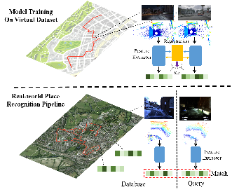

# vLPD-Net: Registration-aided 3D Point Cloud Learning for Large-Scale Place Recognition

Our IROS 2021: Registration-aided 3D Point Cloud Learning for Large-Scale Place Recognition.

[Paper](https://arxiv.org/abs/2012.05018) [Video](https://www.bilibili.com/video/BV1W44y1m7jd?from=search&seid=6528890923617632450)
<html>
Author: <a href="https://qiaozhijian.github.io/">Zhijian Qiao<sup>1&#8224</sup>, <a href="https://hanjianghu.github.io/">Hanjiang Hu<sup>1, 2&#8224</sup></a>, Weiang Shi<sup>1</sup>, Siyuan Chen<sup>1</sup>, Zhe Liu<sup>1, 3</sup>, Hesheng Wang<sup>1</sup>.

Shanghai Jiao Tong University<sup>1</sup> & Carnegie Mellon University<sup>2</sup> & University of Cambridge<sup>3</sup>
</html>



### Introduction
This is the our IROS 2021 work. The synthetic virtual dataset has been utilized through GTA-V to involve multi-environment traverses without laborious human efforts, while the accurate registration ground truth can be obtained at the same time. 

To this end, we propose vLPD-Net, which is a novel registration-aided 3D domain adaptation network for point cloud based place recognition. A structure-aware registration network is proposed to leverage geometry property and co-contextual information between two input point clouds. Along with them, the adversarial training pipeline is implemented to reduce the gap between synthetic and real-world domain.

### Citation
If you find this work useful, please cite:
```
@article{DBLP:journals/corr/abs-2012-05018,
  author    = {Zhijian Qiao, Hanjiang Hu, Weiang Shi, Siyuan Chen, Zhe Liu and Hesheng Wang},
  title     = {{A} Registration-aided Domain Adaptation Network for 3D Point Cloud Based Place Recognition},
  journal   = {CoRR},
  volume    = {abs/2012.05018},
  year      = {2020},
  url       = {https://arxiv.org/abs/2012.05018},
  archivePrefix = {arXiv},
  eprint    = {2012.05018},
  timestamp = {Sat, 02 Jan 2021 15:43:30 +0100},
  biburl    = {https://dblp.org/rec/journals/corr/abs-2012-05018.bib},
  bibsource = {dblp computer science bibliography, https://dblp.org}
}
```

### Environment and Dependencies
Code was tested using Python 3.8 with PyTorch 1.7.1 and MinkowskiEngine 0.5.0 on Ubuntu 18.04 with CUDA 10.2.

The following Python packages are required:
* PyTorch (version 1.7)
* MinkowskiEngine (version 0.5.0)
* pytorch_metric_learning (version 0.9.94 or above)
* tensorboard
* pandas
* psutil
* bitarray

### Datasets
**vLPD-Net** is trained on a subset of Oxford RobotCar datasets and synthetic virtual dataset built on GTAV5. Processed Oxford Robotcar datasets are available in [PointNetVLAD](https://github.com/mikacuy/pointnetvlad.git).  To build the synthetic virtual dataset, we use a plugin [DeepGTAV](https://github.com/aitorzip/DeepGTAV) and its expansion [A-virtual-LiDAR-for-DeepGTAV](https://github.com/gdpinchina/A-virtual-LiDAR-for-DeepGTAV), which provide the vehicle with cameras and LiDAR. Besides, we use [VPilot](https://github.com/aitorzip/VPilot) for better interaction with DeepGTAV. The data collected by the plugins is simply saved in txt files, and then processed and saved with the Oxford Robotcar format. 


The structure of directory is like this:
```
vLPD-Net
└── benchmark_datasets
     ├── GTA5
     └── oxford
```

To generate pickles, run:
```generate pickles
cd generating_queries/ 

# Generate training tuples for the Oxford Dataset
python generate_training_tuples_baseline.py

# Generate evaluation Oxford tuples
python generate_test_sets.py

# In addition, if you also want to experiment on GTAV5, we have open sourced the code for processing this dataset. We hope it will be helpful to you.
# Generate training tuples for the gtav5 Dataset
python generate_training_tuples_baseline_gtav5.py

# Generate evaluation gtav5 tuples
python generate_test_sets_gtav5.py
```

### Training
We train vLPD-Net on one 2080Ti GPU.

To train the network, run:

```train baseline
# To train vLPD-Net model on the Oxford Dataset
export OMP_NUM_THREADS=24;CUDA_VISIBLE_DEVICES=0 python train.py --config ./config/config_baseline.txt --model_config ./config/models/vlpdnet.txt

# To train vLPD-Net model on the GTAV5 Dataset
export OMP_NUM_THREADS=24;CUDA_VISIBLE_DEVICES=0 python train.py --config ./config/config_baseline_gtav5.txt --model_config ./config/models/vlpdnet.txt
```

For registration on oxford dataset, we transform point cloud by ourself to generate ground truth. The registration training piplines on two datasets are also a bit different. On oxford dataset, we just use EPCOR in inference while we train with EPCOR on GTAV5 based on a pretrained whole-to-whole registration model like [VCR-Net](https://github.com/qiaozhijian/VCR-Net.git). This is due to the fact that registration on Oxford dataset is naturally whole-to-whole.
### Pre-trained Models

Pretrained models are available in `weights` directory
- `vlpdnet-oxford.pth` trained on the Oxford Dataset 
- `vlpdnet-gtav5.pth` trained on the GTAV5 Dataset with domain adaptation
- `vlpdnet-registration.t7` trained on the Oxford Dataset for registration.

### Evaluation

To evaluate pretrained models, run the following commands:

```eval baseline

# To evaluate the model trained on the Oxford Dataset 
export OMP_NUM_THREADS=24;CUDA_VISIBLE_DEVICES=0 python evaluate.py --config ./config/config_baseline.txt --model_config ./config/models/vlpdnet.txt --weights=./weights/vlpdnet-oxford.pth 

# To evaluate the model trained on the GTAV5 Dataset
export OMP_NUM_THREADS=24;CUDA_VISIBLE_DEVICES=0 python evaluate.py --config ./config/config_baseline.txt --model_config ./config/models/vlpdnet.txt --weights=./weights/vlpdnet-gtav5.pth

# To evaluate the model trained on the Oxford Dataset for registration
export OMP_NUM_THREADS=24;CUDA_VISIBLE_DEVICES=0 python evaluate.py --config ./config/config_baseline.txt --model_config ./config/models/vlpdnet.txt --eval_reg=./weights/vlpdnet-registration.t7
```

### Acknowledgment

[MinkLoc3D](https://github.com/jac99/MinkLoc3D.git)

[VCR-Net](https://github.com/qiaozhijian/VCR-Net.git)

[LPD-Net-Pytorch](https://github.com/qiaozhijian/LPD-Net-Pytorch.git)

### License
Our code is released under the MIT License (see LICENSE file for details).
